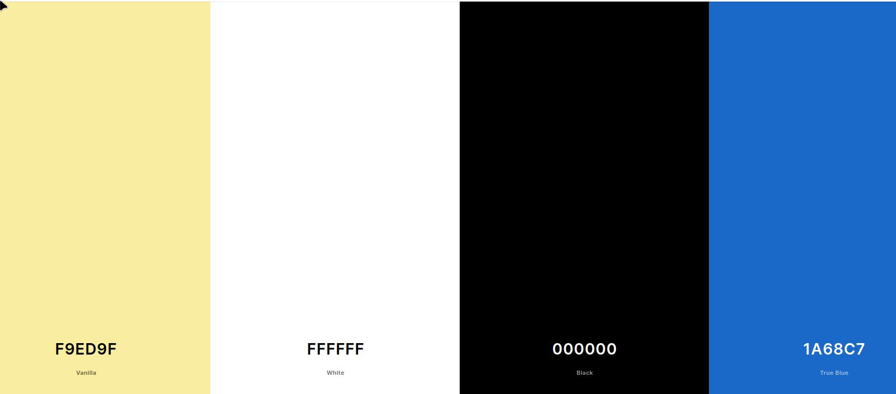
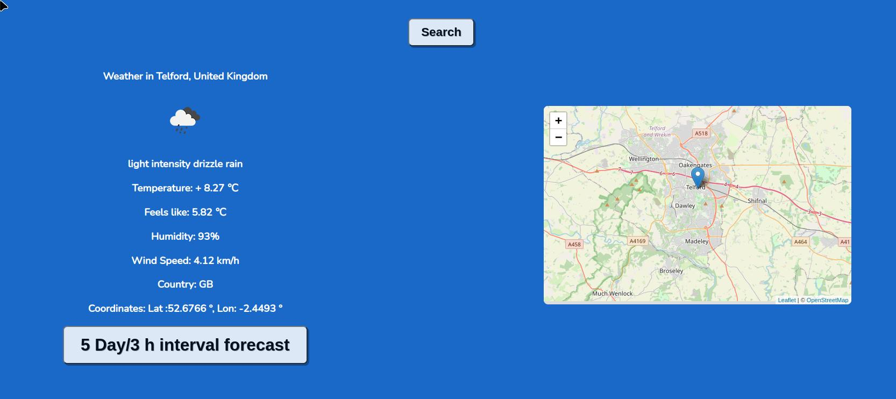
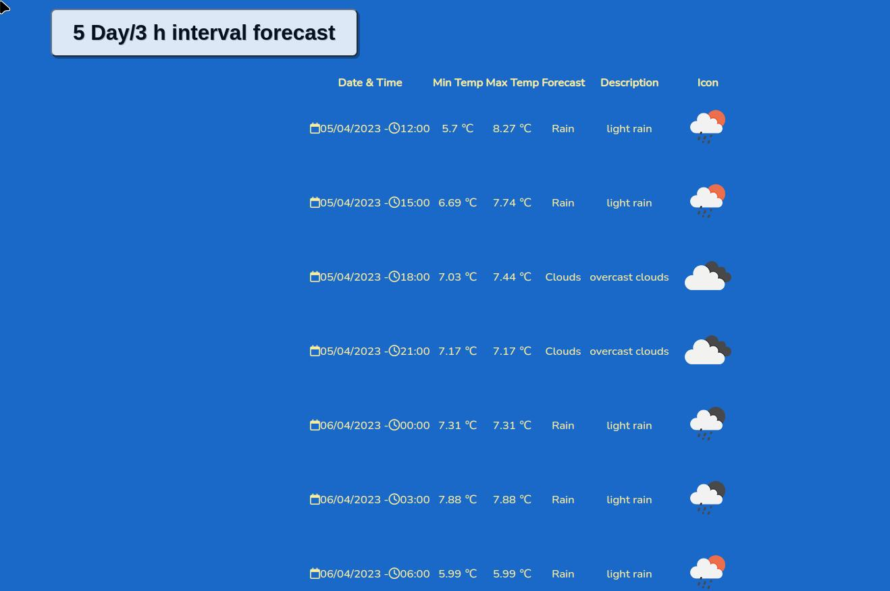

# Weather App

Weathe App is a simple and responsive  website where the user can find weather information like temperature, wind speed, humidity, location displayed on a map for better orientation, all this in real time.

Weather App is intended for any kind of user who wants to find weather and location information for a specific location using the search input and the search button at the top.
Weather App it is very easy to use with a simple and intuitive design.

## UX

A simple, yet modern design, wich contains an input element and a search button in the first phase.
After inserting a location in the text input and click search, two more divs will be added. First div contains weather data, second div contains a map with the location pinned.

### Colour Scheme
Simple and with a good contrast color scheme.

- `#FFFF00` used for heading and user feedback text.
- `#fff` used for weather info text.
- `#000` default font color, used for forecast text.
- `#3b93db` used as background for body and buttons.

I used [coolors.co](https://coolors.co/ffff00-ffffff-000000-3b93db) to generate my colour palette.

### Typography
- [Nunito](https://fonts.google.com/specimen/Nunito)

## User Stories

### New Site Users
- As a new site user, I would like to be able to find information about weather in a specific location.

### Returning Site Users
- As a returning site user, I would like to find weather information easy and fast.

### Site Admin
- As a site administrator, I should be able to help users find detailed weather information for the location they are looking for.

## Wireframes
### Mobile Wireframes

### Tablet Wireframes

### Desktop Wireframes

## Features
### Existing Features

- **Feature #1** 
First feature contains a search box, a country select element and a search button allowing users to search weather information based on city and country name.

- **Feature #2**
Feature two consists in displaying weather information and location on the map, elements beeing generated based on search action.

- **Feature #3**
Feature three cosnsists of a button that when is pressed will display a 5day/3h interval weather forecast.
Based on data received from API, a table is generated with javascript and detailed weather info is displayed.

- **Feature #4**
Feature four consits in a footer with font awesome icons and links to external pages/social media.

## Tools & Technologies Used
Technologies used to build this website are:
- [HTML](https://en.wikipedia.org/wiki/HTML) used for the site content.
- [CSS](https://en.wikipedia.org/wiki/CSS) used for the site design and layout.
- [JavaScript](https://www.javascript.com) used for user interaction on the site.
- [Git](https://git-scm.com) used for version control. (`git add`, `git commit`, `git push`)
- [GitHub](https://github.com) used for secure online code storage.
- [Tim Nelson](https://traveltimn.github.io/readme-builder) used to help generate the Markdown files.
- [Vercel](https://vercel.com/) used for hosting the deployed site.

## Deployment

The site was deployed to GitHub Pages. The steps to deploy are as follows:
- In the [GitHub repository](https://github.com/bubtroniq/weather-app), navigate to the Settings tab 
- From the source section drop-down menu, select the **Main** Branch, then click "Save".
- The page will be automatically refreshed with a detailed ribbon display to indicate the successful deployment.

The live link can be found [here](weather-app-bubtroniq.vercel.app)
### Local Deployment
This project can be cloned or forked in order to make a local copy on your own system.

#### Cloning

You can clone the repository by following these steps:

1. Go to the [GitHub repository](https://github.com/bubtroniq/weather-app) 
2. Locate the Code button above the list of files and click it 
3. Select if you prefer to clone using HTTPS, SSH, or GitHub CLI and click the copy button to copy the URL to your clipboard
4. Open Git Bash or Terminal
5. Change the current working directory to the one where you want the cloned directory
6. In your IDE Terminal, type the following command to clone my repository:
	- `git clone https://github.com/bubtroniq/weather-app`
7. Press Enter to create your local clone.

Alternatively, if using Gitpod, you can click below to create your own workspace using this repository.

Please note that in order to directly open the project in Gitpod, you need to have the browser extension installed.
A tutorial on how to do that can be found [here](https://www.gitpod.io/docs/configure/user-settings/browser-extension).

#### Forking
By forking the GitHub Repository, we make a copy of the original repository on our GitHub account to view and/or make changes without affecting the original owner's repository.
You can fork this repository by using the following steps:

1. Log in to GitHub and locate the [GitHub Repository](https://github.com/bubtroniq/weather-app)
2. At the top of the Repository (not top of page) just above the "Settings" Button on the menu, locate the "Fork" Button.
3. Once clicked, you should now have a copy of the original repository in your own GitHub account!

### Local VS Deployment
There is no difference between local version and the live deployed site.

## Credits
Use this space to provide attribution links to any borrowed code snippets, elements, or resources.
A few examples have been provided below to give you some ideas.

Ideally, you should provide an actual link to every resource used, not just a generic link to the main site!

| Source | Location | Notes |
| --- | --- | --- |
| [Tim Nelson](https://traveltimn.github.io/readme-builder) | README and TESTING | tool to help generate the Markdown files |
| [YouTube](https://www.youtube.com/watch?v=WZNG8UomjSI) | main page | weather app tutorial used for inspiration|
| [YouTube](https://www.youtube.com/watch?v=NyjMmNCtKf4) | main page | tutorial for leafletJS map|
| [YouTube](https://www.youtube.com/watch?v=G4T2ZgJPKbw) | main page | destructuring objects in JavaScript |
| [YouTube](https://www.youtube.com/watch?v=tc8DU14qX6I) | main page | tutorial for fetching API data|

### Media

Icons and API used in project.

| Source | Location | Type | Notes |
| --- | --- | --- | --- |
| [Font Awesome](https://fontawesome.com/) | main page| icons | calendar and clock icons in forecast table |
| [OpenWeatherMap Icons](https://openweathermap.org/weather-conditions#How-to-get-icon-URL) | main page| icons | icon in current weather info and icons in forecast interval table data |
| [OpenWeatherMap OneCall API](https://openweathermap.org/api/one-call-3) | main page| icons | icon in current weather info and icons in forecast interval table data |
| [OpenWeatherMap OneCall API](https://openweathermap.org/api/one-call-3) | main page| weather info | current weather info |
| [OpenWeatherMap 5 day 3 hour forecast data API](https://openweathermap.org/forecast5) | main page| weather info | 5day/3h interval forecast table data |
| [LeafletJS Map](https://leafletjs.com/) | main page| location info | displaying location with a marker on leafletJS map |

### Acknowledgements
- I would like to thank my Code Institute mentor, [Tim Nelson](https://github.com/TravelTimN/ci-ifd-lead) for his patience, support and suggestions throughout the development of this project.
- I would like to thank my coleagues from Newcastle College, for ideas and suggestions towards developing this project.

Go to the to the [TESTING.md](TESTING.md) file.
