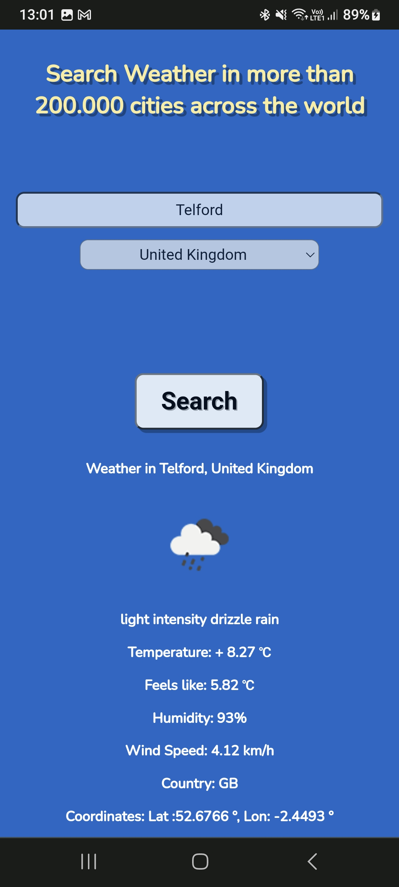
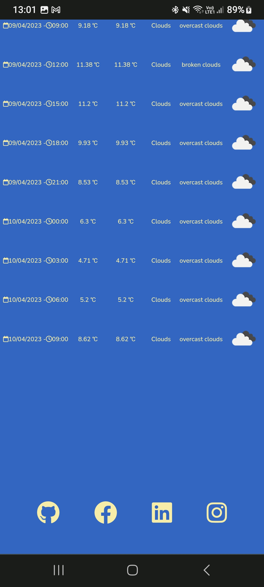
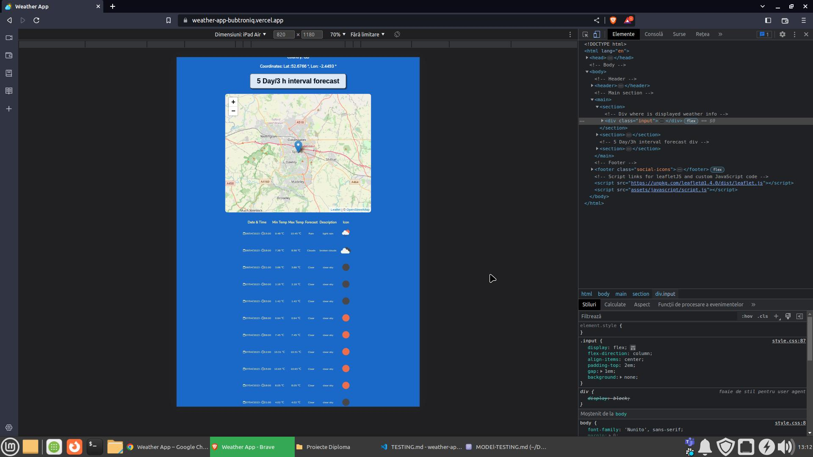
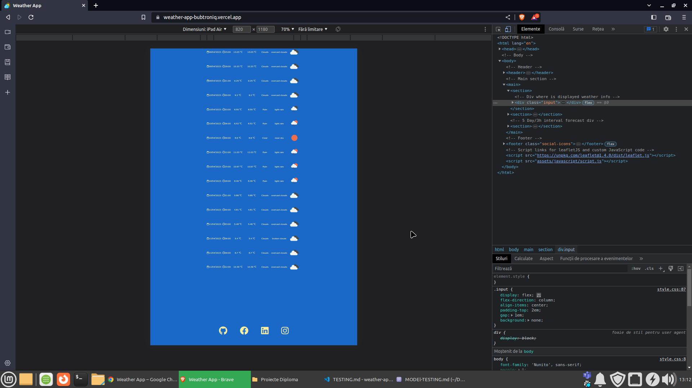
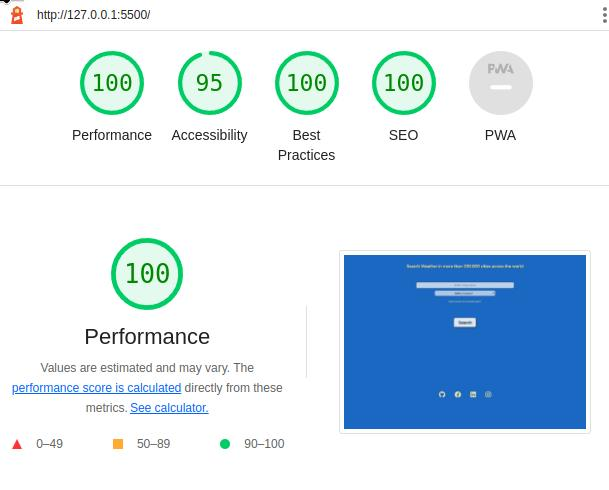

# Testing

## Code Validation

### HTML
- No errors or warnings were found when passing through the [W3C Markup Validator](https://validator.w3.org/nu/?doc=https%3A%2F%2Fweather-app-bubtroniq.vercel.app%2F).

### CSS
- No errors or warnings were found when passing through the [W3C CSS Validator](https://jigsaw.w3.org/css-validator/).

### JS
- One undefined variable L, it is from leafletJS map.

## Browser Compatibility

| Device | Screenshot | Notes |
| --- | --- | --- |
| Chrome  |  | Works as expected |
| Chrome  |  | Works as expected |
| Chrome  |  | Works as expected |
| Firefox  |  | Works as expected |
| Firefox  |  | Works as expected |
| Firefox  |  | Works as expected |
| Brave  |  | Works as expected |
| Brave  |  | Works as expected |
| Brave  |  | Works as expected |

## Responsiveness

| Device | Screenshot | Notes |
| --- | --- | --- |
| Mobile (Samsung A33) |  | Works as expected |
| Mobile (Samsung A33) |  | Works as expected |
| Mobile (Samsung A33) |  | Works as expected |
| Mobile (Samsung A33) |  | Works as expected |
| Mobile (Samsung A33) |  | Works as expected |
| Mobile (Samsung A33) |  | Works as expected |
| Tablet (Samsung S8+) |  | Works as expected |
| Tablet (Samsung S8+) |  | Works as expected |
| Tablet (Samsung S8+) |  | Works as expected |
| Chrome Mobile (DevTools) |  | Works as expected |
| Chrome Mobile (DevTools) |  | Works as expected |
| Chrome Mobile (DevTools) |  | Works as expected |
| Firefox Mobile (DevTools) |  | Works as expected |
| Firefox Mobile (DevTools) |  | Works as expected |
| Firefox Mobile (DevTools) |  | Works as expected |
| Brave Mobile (DevTools) |  | Works as expected |
| Brave Mobile (DevTools) |  | Works as expected |
| Brave Mobile (DevTools) |  | Works as expected |
| Chrome Tablet (DevTools) |  | Works as expected |
| Chrome Tablet (DevTools) |  | Works as expected |
| Chrome Tablet (DevTools) |  | Works as expected |
| Firefox Tablet (DevTools) |  | Works as expected |
| Firefox Tablet (DevTools) |  | Works as expected |
| Firefox Tablet (DevTools) |  | Works as expected |
| Brave Tablet (DevTools) |  | Works as expected |
| Brave Tablet (DevTools) |  | Works as expected |
| Brave Tablet (DevTools) |  | Works as expected |
| Chrome Desktop |  | Works as expected |
| Chrome Desktop |  | Works as expected |
| Chrome Desktop |  | Works as expected |
| Firefox Desktop |  | Works as expected |
| Firefox Desktop |  | Works as expected |
| Firefox Desktop |  | Works as expected |
| Brave Desktop |  | Works as expected |
| Brave Desktop |  | Works as expected |
| Brave Desktop |  | Works as expected |

## Lighthouse Audit
### Desktop Lighthouse audit

### Mobile Lighthouse audit 

## Bugs

- Alot of trial and error fetching both API's and displaying data on the go modifying DOM structure. - fixed/practicing fetch API data and destructuring objects + DOM manipulation practice and inspiration.
- Had to setTimeout() on the changeBackground function to fix background picture in one click, otherwise 2 clicks required in order to set the proper background, defined in switch statement. - fixed/used includes() method on description object with if else statements to change background picture, was working but gave up on the ideea because of contrast issues.
- Lots of issues with retrievieng coordinates from data object. - fixed/practicing fetch API data and destructuring objects + DOM manipulation practice and inspiration.
- After first search map is not updating with new coordinates. - fixed/defined a function to generate map, for second+ searches a clearLayers method will clear previous map view and will set new marker and map view to new fetched coords.
- Alot of errors to be managed when fetching API data. - fixed/catch errors with "try, catch syntax"
- Background picture that is changing regarding description message needs fixing on mobile view.-fixed/no background picture anymore.

## Unfixed Bugs

- Markers from previous searches will remain pinned on map. - not fixed, minor bug not affecting functionality or UI

Return to the [README.md](README.md) file.